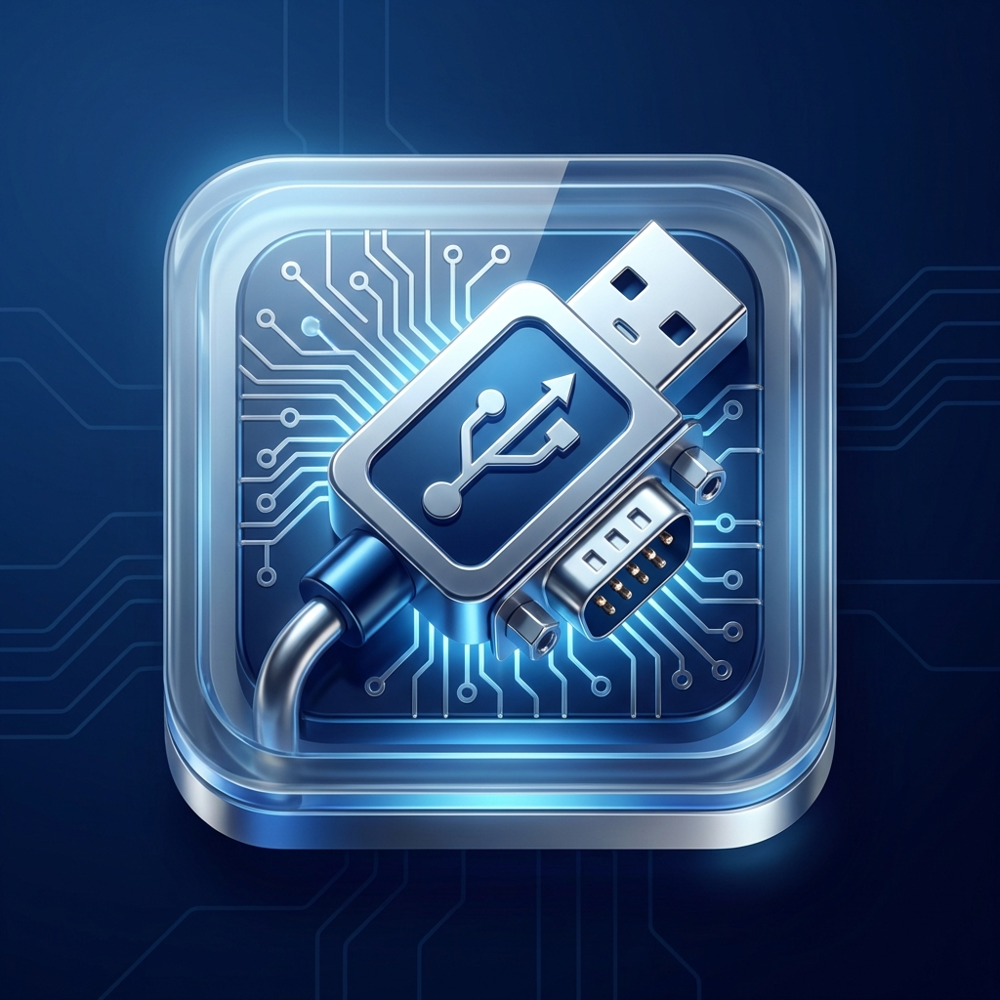

# SparkSerial Pro

A lightweight Serial GUI Tool for hardware testing and debugging built with Python and PyQt6. Inspired by professional tools like Docklight and CoolTerm, **SparkSerial** provides a modern, user-friendly interface for engineers and developers.



## ⚠️ Important: USB Driver Requirement

**SparkSerial is a GUI application only.** It does not include USB-to-Serial drivers. You must install the appropriate driver for your USB-to-Serial adapter/converter separately.

### Common Drivers:
- **FTDI chips (FT232, FT2232)**: [FTDI Drivers](https://ftdichip.com/drivers/)
- **CH340/CH341**: [CH340 Driver](http://www.wch-ic.com/downloads/CH341SER_MAC_ZIP.html)
- **CP210x (Silicon Labs)**: [CP210x Drivers](https://www.silabs.com/developers/usb-to-uart-bridge-vcp-drivers)
- **PL2303 (Prolific)**: [PL2303 Driver](http://www.prolific.com.tw/US/ShowProduct.aspx?p_id=229&pcid=41)

After installing the driver, your serial port should appear in the Port dropdown.

## Features

- **Professional Configuration**: Comprehensive port settings (Baudrate up to 921600, Data Bits, Parity, Stop Bits, Flow Control, Line Ending).
- **Command Shortcuts**: Save frequently used commands (Text or Hex) for quick access and batch testing.
- **Find/Replace**: Bulk find and replace text across all saved commands.
- **Command History**: Use ↑/↓ arrow keys to navigate through previously sent commands.
- **Advanced Terminal**: Real-time logging with timestamps, Hex view, and autoscroll.
- **Persistence**: Automatically saves your command library.
- **Modern UI**: Industry-standard dark-mode aesthetic optimized for hardware debugging.
- **Cross-Platform**: Designed for macOS, Windows, and Linux.

## Installation

### From PyPI
```bash
pip install sparkserial
```

### Local Development
Ensure you have [uv](https://github.com/astral-sh/uv) installed:

```bash
./setup.sh
./run.sh
```

## Usage

After installing via pip, you can launch the tool directly:
```bash
sparkserial
```

## System Requirements

- **Python**: 3.11 or higher
- **Operating System**: macOS, Windows, or Linux
- **USB Driver**: Required for your specific USB-to-Serial adapter (see above)

## Technologies Used

- **UI Framework**: PyQt6
- **Serial Communication**: PySerial
- **Backend Architecture**: Worker-thread pattern for non-blocking I/O
- **Styling**: Custom dark-mode theme with industry-standard aesthetics

## Version

Current version: **0.2.0**

## Author

**Saravanakumar**  
Email: sarvalece71@gmail.com

## License

MIT License - See [LICENSE](LICENSE) for details.
